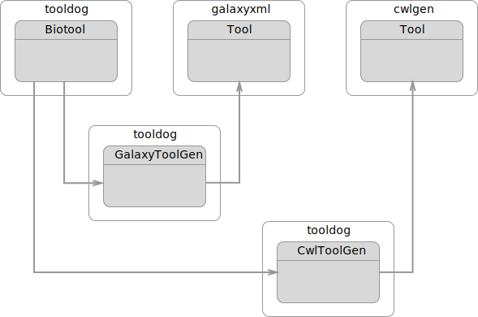
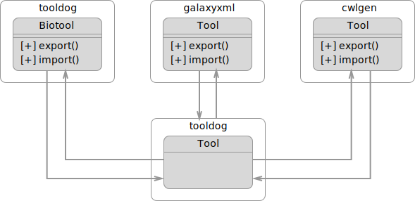

.. ToolDog - Tool description generator

.. _hangouts:

********
Hangouts
********

23 May 2017
===========

Ivan Kuzmin and Kenzo-Hugo Hillion

Discussion about the following points:

* Deliverable by the end of June

  * Link analysis part into ToolDog
  * Identify good example from https://bio.tools for demo

* Discussion about possible evolution of Tooldog and the library it uses

  * Evolution of the library galaxyxml and cwlgen
  * Build a similar model for bio.tools entries

24–28 April 2017, Paris
=======================

The meeting was to set up the collaboration between ELIXIR France (Hervé Menager, Kenzo-Hugo Hillion) and ELIXIR Estonia (Hedi Peterson, Ivan Kuzmin) nodes on the development of the workbench integration enabler.

Currently the tool generates Galaxy XML or CWL directly from the bio.tools tool description file in JSON as shown in the following figure.

|current_design|

After discussing the design of the tool an idea for a new architecture has emerged. ToolDog will not simply be monodirectional, but instead would allow to go from any given tool descriptor to another one as illustrated in the next figure.

|proposed_design|

Therefore, work is going to be first focused on both galaxyxml and cwlgen libraries to cover all different fields from corresponding tool descriptors. Then this libraries need to allow accurate import of existing files into the corresponding model. After that the new model for ToolDog can be built.

.. TODO: Write descriptive alt-text in HUTN

.. TODO: Write descriptive alt-text in HUTN
