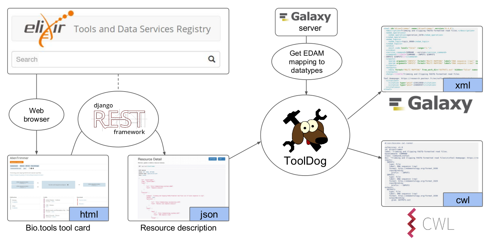

.. ToolDog - Tool description generator

.. _introduction:

************
Introduction
************

During the last years, integration of various tools has been eased by the use of workbench
systems such as Galaxy or frameworks using Common Workflow Language.
Still, it remains time consuming and not straightforward to adapt resources to such
environments. **ToolDog** (Tool DescriptiOn Generator) is the main component of the Workbench
Integration Enabler service of the ELIXIR bio.tools registry, that guides the integration
of tools into workbench environments.

|tooldog_figure|

